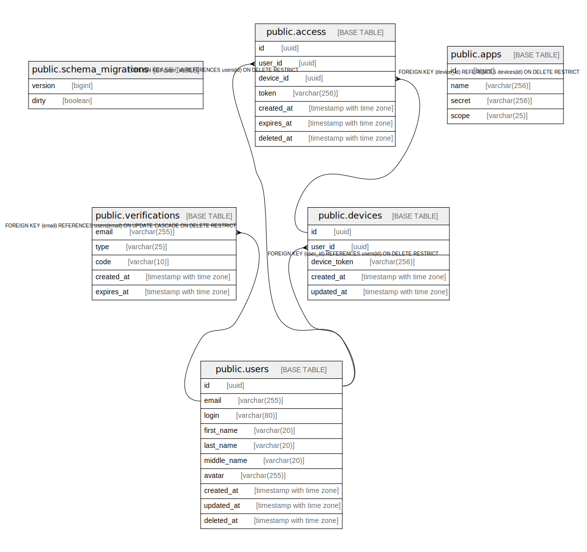

# mixery

## Tables

| Name | Columns | Comment | Type |
| ---- | ------- | ------- | ---- |
| [public.schema_migrations](public.schema_migrations.md) | 2 |  | BASE TABLE |
| [public.users](public.users.md) | 10 |  | BASE TABLE |
| [public.verifications](public.verifications.md) | 5 |  | BASE TABLE |
| [public.devices](public.devices.md) | 5 |  | BASE TABLE |
| [public.access](public.access.md) | 7 |  | BASE TABLE |
| [public.apps](public.apps.md) | 4 |  | BASE TABLE |

## Relations

---

> Generated by [tbls](https://github.com/k1LoW/tbls)
