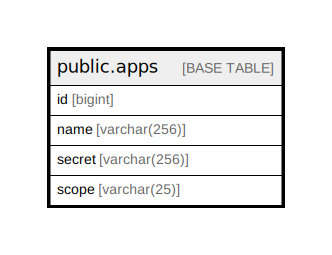

# public.apps

## Description

## Columns

| Name | Type | Default | Nullable | Children | Parents | Comment |
| ---- | ---- | ------- | -------- | -------- | ------- | ------- |
| id | bigint | nextval('app_id_seq'::regclass) | false |  |  |  |
| name | varchar(256) |  | false |  |  |  |
| secret | varchar(256) |  | false |  |  |  |
| scope | varchar(25) | 'userinfo'::character varying | false |  |  |  |

## Constraints

| Name | Type | Definition |
| ---- | ---- | ---------- |
| apps_pkey | PRIMARY KEY | PRIMARY KEY (id) |

## Indexes

| Name | Definition |
| ---- | ---------- |
| apps_pkey | CREATE UNIQUE INDEX apps_pkey ON public.apps USING btree (id) |

## Relations

---

> Generated by [tbls](https://github.com/k1LoW/tbls)
