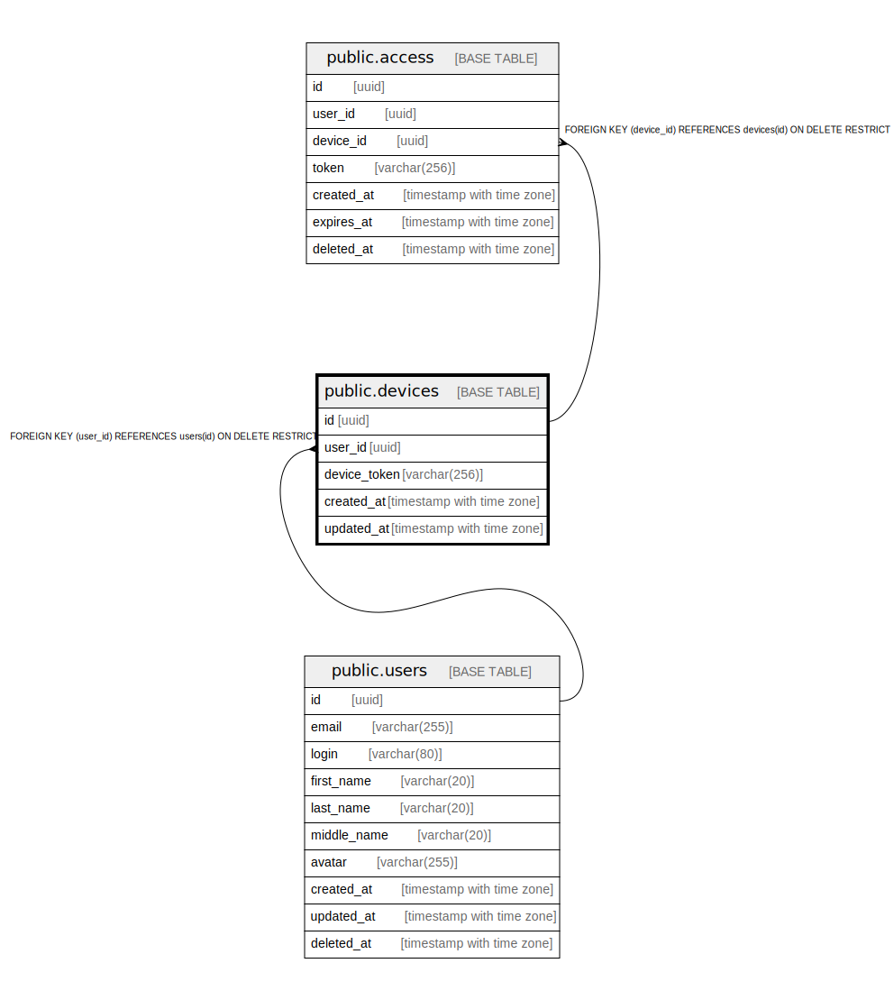

# public.devices

## Description

## Columns

| Name | Type | Default | Nullable | Children | Parents | Comment |
| ---- | ---- | ------- | -------- | -------- | ------- | ------- |
| id | uuid |  | false | [public.access](public.access.md) |  |  |
| user_id | uuid |  | false |  | [public.users](public.users.md) |  |
| device_token | varchar(256) |  | false |  |  |  |
| created_at | timestamp with time zone | CURRENT_TIMESTAMP | false |  |  |  |
| updated_at | timestamp with time zone | CURRENT_TIMESTAMP | false |  |  |  |

## Constraints

| Name | Type | Definition |
| ---- | ---- | ---------- |
| devices_user_id_fkey | FOREIGN KEY | FOREIGN KEY (user_id) REFERENCES users(id) ON DELETE RESTRICT |
| devices_pkey | PRIMARY KEY | PRIMARY KEY (id) |

## Indexes

| Name | Definition |
| ---- | ---------- |
| devices_pkey | CREATE UNIQUE INDEX devices_pkey ON public.devices USING btree (id) |

## Relations

---

> Generated by [tbls](https://github.com/k1LoW/tbls)
