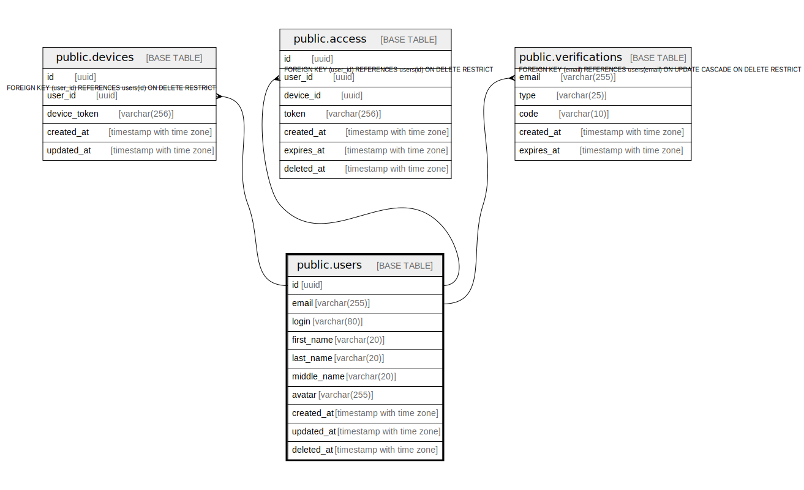

# public.users

## Description

## Columns

| Name | Type | Default | Nullable | Children | Parents | Comment |
| ---- | ---- | ------- | -------- | -------- | ------- | ------- |
| id | uuid |  | false | [public.devices](public.devices.md) [public.access](public.access.md) |  |  |
| email | varchar(255) |  | false | [public.verifications](public.verifications.md) |  |  |
| login | varchar(80) |  | false |  |  |  |
| first_name | varchar(20) | ''::character varying | false |  |  |  |
| last_name | varchar(20) | ''::character varying | false |  |  |  |
| middle_name | varchar(20) | ''::character varying | false |  |  |  |
| avatar | varchar(255) |  | false |  |  |  |
| created_at | timestamp with time zone | CURRENT_TIMESTAMP | false |  |  |  |
| updated_at | timestamp with time zone | CURRENT_TIMESTAMP | false |  |  |  |
| deleted_at | timestamp with time zone |  | true |  |  |  |

## Constraints

| Name | Type | Definition |
| ---- | ---- | ---------- |
| users_pkey | PRIMARY KEY | PRIMARY KEY (id) |
| users_email_key | UNIQUE | UNIQUE (email) |
| users_login_key | UNIQUE | UNIQUE (login) |

## Indexes

| Name | Definition |
| ---- | ---------- |
| users_pkey | CREATE UNIQUE INDEX users_pkey ON public.users USING btree (id) |
| users_email_key | CREATE UNIQUE INDEX users_email_key ON public.users USING btree (email) |
| users_login_key | CREATE UNIQUE INDEX users_login_key ON public.users USING btree (login) |

## Relations

---

> Generated by [tbls](https://github.com/k1LoW/tbls)
