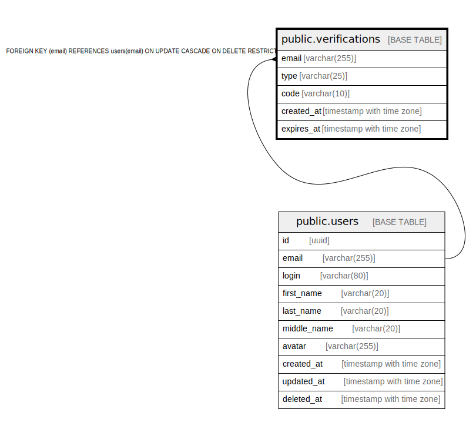

# public.verifications

## Description

## Columns

| Name | Type | Default | Nullable | Children | Parents | Comment |
| ---- | ---- | ------- | -------- | -------- | ------- | ------- |
| email | varchar(255) |  | false |  | [public.users](public.users.md) |  |
| type | varchar(25) |  | false |  |  |  |
| code | varchar(10) |  | false |  |  |  |
| created_at | timestamp with time zone | CURRENT_TIMESTAMP | false |  |  |  |
| expires_at | timestamp with time zone |  | false |  |  |  |

## Constraints

| Name | Type | Definition |
| ---- | ---- | ---------- |
| verifications_email_fkey | FOREIGN KEY | FOREIGN KEY (email) REFERENCES users(email) ON UPDATE CASCADE ON DELETE RESTRICT |
| verifications_pkey | PRIMARY KEY | PRIMARY KEY (email) |

## Indexes

| Name | Definition |
| ---- | ---------- |
| verifications_pkey | CREATE UNIQUE INDEX verifications_pkey ON public.verifications USING btree (email) |

## Relations

---

> Generated by [tbls](https://github.com/k1LoW/tbls)
